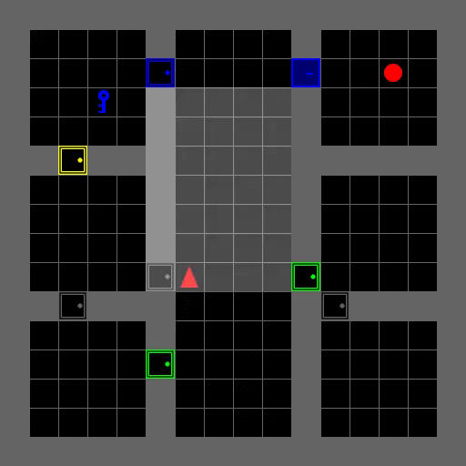
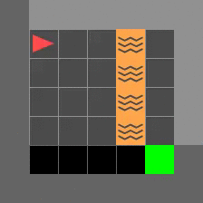
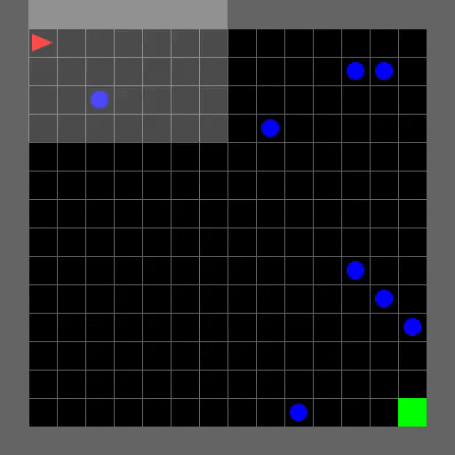

# Reinforcement learning - Projects

AIM - 
1. Run openAI gym in Jupyter notebook(google colab), with virtual screen
2. Basic Neural networks for learning

## Jupyter notebooks 

### 0. First env - Cartpole.ipynb
Working with OPenAI environments in google colab, with a virtual display   
### 1. Looking into all environments.ipynb
Exploring different environments of OpenAI

## Folder contents - 
Day 10 - Cartpole and Mountain car
Day 22 - RL aglorithms
Day 23 - Pacman
Day 24 - Atari games -  AirRaid,SpaceInvaders, Breakout
Day 25 - Robotic arm
Day 26 - Mujuco
Day 27 - GymGo

    
 

### Opengym_MiniGrid.ipynb

   width = "164" height ="200" alt="Starcraft"/>
 
 width = "164" height ="200"/>
  

### Opengym_rubiks_cube_gym_env.ipynb

