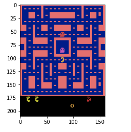

# Atari games - Reinforcement learning

AIM - 
1. Run openAI gym in Jupyter notebook(google colab), with virtual screen
2. Basic Neural networks for learning

## Games to try -   
1 - Cartpole
2 - Mountain car
3 - Atari - AirRaid
4 - Atari - Pacman
5 - Atari - Breakout

File "Agent to Play Atari Games.ipynb" - source - https://github.com/sudharsan13296/Hands-On-Reinforcement-Learning-With-Python

